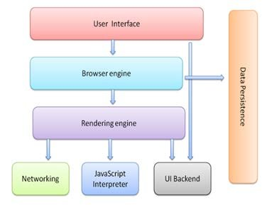
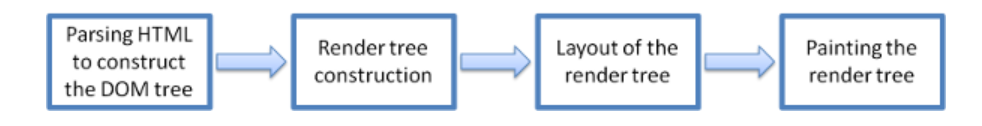
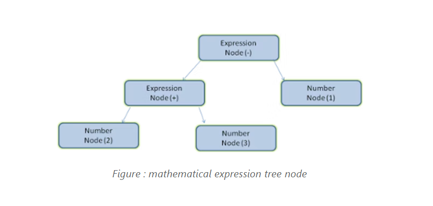
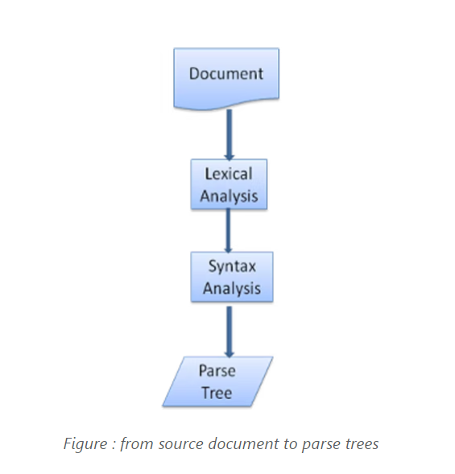
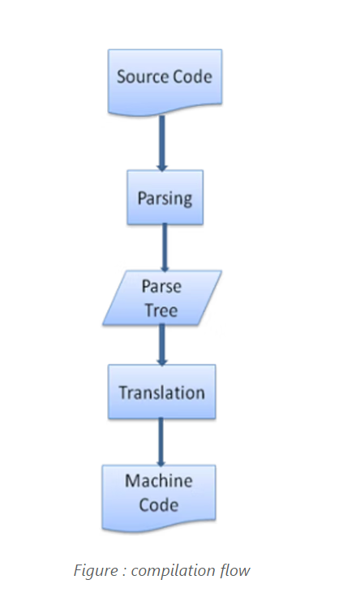
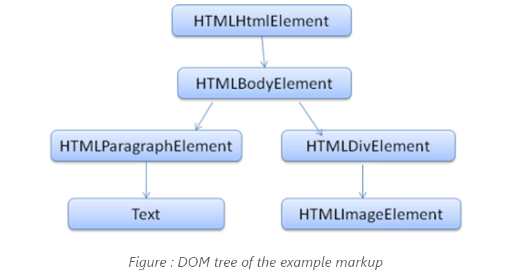
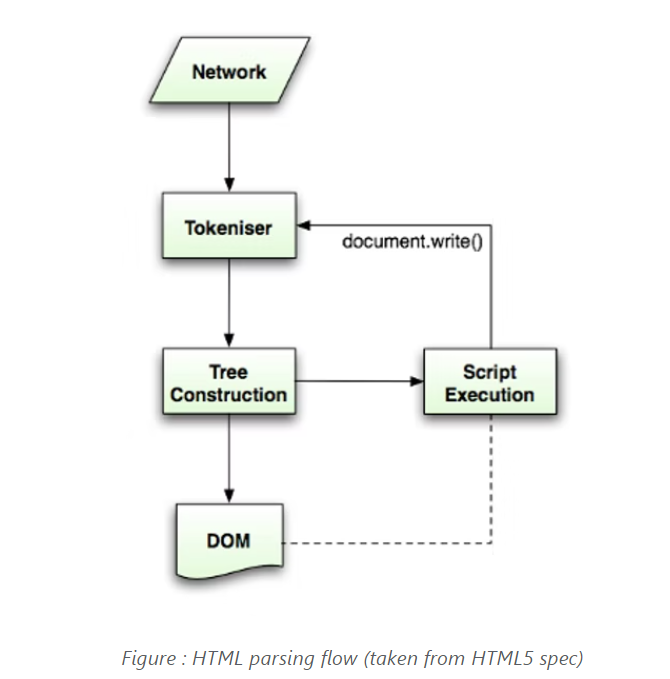
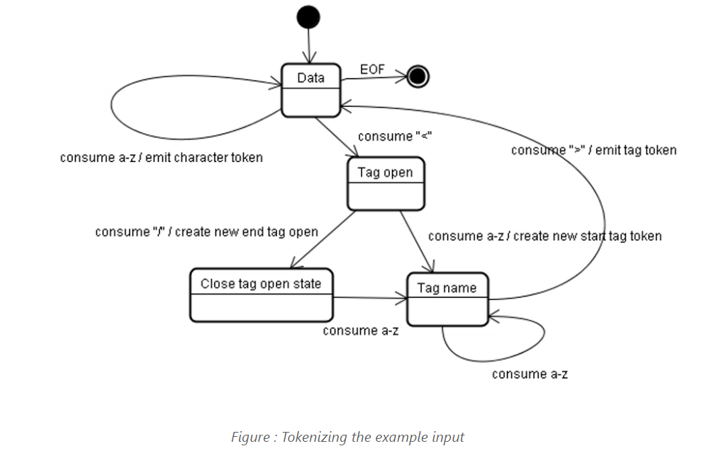
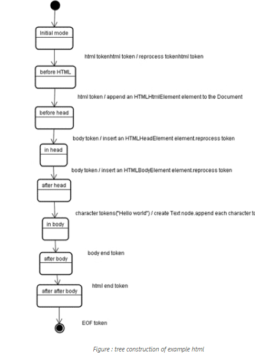

# Week1 Assignment1 - HTML
Assignment on HTML

## How a Browser Works
When a user enters an URL in the browser, how does the browser fetch the desired result ? Explain this with the below in mind and Demonstrate this by drawing a diagram for the same

1. What is the main functionality of the browser?
2. High Level Components of a browser.
3. Rendering engine and its use.
4. Parsers (HTML, CSS, etc)
5. Script Processors
6. Tree construction
7. Order of script processing
8. Layout and Painting


## Guidelines:

1. Submit this assignment on GIT - Answer should be in readme File (with images) on GIT.
2. Candidates should be able to explain how a browser works.
3. What are the high level components of a browser?
4. How each component works with each other. (For example: Networking component is the one which makes HTTP calls, Data storage component is a browser’s persistence layer which saves data locally such as Cookies and Local Storage.
5. How Parsing works and its importance.
6. The order of execution of scripts.

## Outcome:

1. Under the hood understanding of how a browser works.
2. What are the features a browser provides?
3. What a browser is capable of doing.
4. How a web page is translated from a string in a URL to a webpage.

## What is the main functionality of the browser?

What is the role of a browser in a client server?

- Browser plays the client side interface role in Client Server Architecture
- Browser allow client device to connect to a webserver and read the HTML files located on it
- When the web browser send request to web server, these files are transferred to your computer as response that is interpreted by web browser to display the content
- Web browser allow users to interact with web pages and other dynamic contents via hyperlinks that provides navigation facility i.e. to go to different locations by clicking on links that makes internet surfing easy

Let us have a look on its processing. When user type any URL, for example https://google.com, the prefix of the URL decide how to retrieve it. The URL prefixes that the web browser is not able to handle directly is sent to related application. Like default email app is responsible to handle mailto: URL prefix.

Following table gives an idea about some of the common URL prefixes:

| **URL Prefix** | **URL Interpretation** |
| :---: | :---:|
| http: | Hypertext transfer protocol |
| https: | Secured hypertext transfer protocol |
| ftp: | File transfer protocol |
| file: | Local File System |

## Browser High Level Structure

Lets understand the Browser components 

# 

The browser's main components are:

1. **The user interface:** This includes the address bar, back/forward button, bookmarking menu, etc. Every part of the browser display except the window where you see the requested page.
2. **The browser engine:** marshals actions between the UI and the rendering engine.
3. **The rendering engine:** responsible for displaying requested content. For example if the requested content is HTML, the rendering engine parses HTML and CSS, and displays the parsed content on the screen.
4. **Networking:** For network calls such as HTTP requests, using different implementations for different platform behind a platform-independent interface.
5. **UI backend:** used for drawing basic widgets like combo boxes and windows. This backend exposes a generic interface that is not platform specific. Underneath it uses operating system user interface methods.
6. **JavaScript interpreter:** Used to parse and execute JavaScript code.
7. **Data storage:** This is a persistence layer. The browser may need to save all sorts of data locally, such as cookies. Browsers also support storage mechanisms such as localStorage, IndexedDB, WebSQL and FileSystem.

## Rendering engine and its use

The responsibility of the rendering engine is well... Rendering, that is display of the requested contents on the browser screen.

By default the rendering engine can display HTML and XML documents and images. It can display other types of data via plug-ins or extension; for example, displaying PDF documents using a PDF viewer plug-in. However, in this chapter we will focus on the main use case: displaying HTML and images that are formatted using CSS.

# Rendering engines

Different browsers use different rendering engines: Internet Explorer uses Trident, Firefox uses Gecko, Safari uses WebKit. Chrome and Opera (from version 15) use Blink, a fork of WebKit.

WebKit is an open source rendering engine which started as an engine for the Linux platform and was modified by Apple to support Mac and Windows. See webkit.org for more details.

# The main flow

The rendering engine will start getting the contents of the requested document from the networking layer. This will usually be done in 8kB chunks.

After that, this is the basic flow of the rendering engine:

# 

**Figure : Rendering engine basic flow**

The rendering engine will start parsing the HTML document and convert elements to DOM nodes in a tree called the "content tree". The engine will parse the style data, both in external CSS files and in style elements. Styling information together with visual instructions in the HTML will be used to create another tree: the render tree.

The render tree contains rectangles with visual attributes like color and dimensions. The rectangles are in the right order to be displayed on the screen.

After the construction of the render tree it goes through a "layout" process. This means giving each node the exact coordinates where it should appear on the screen. The next stage is painting–the render tree will be traversed and each node will be painted using the UI backend layer.

It's important to understand that this is a gradual process. For better user experience, the rendering engine will try to display contents on the screen as soon as possible. It will not wait until all HTML is parsed before starting to build and layout the render tree. Parts of the content will be parsed and displayed, while the process continues with the rest of the contents that keeps coming from the network.

## Parsers (HTML, CSS, etc)

# Parsing - general

Since parsing is a very significant process within the rendering engine, we will go into it a little more deeply. Let's begin with a little introduction about parsing.

Parsing a document means translating it to a structure the code can use. The result of parsing is usually a tree of nodes that represent the structure of the document. This is called a parse tree or a syntax tree.

For example, parsing the expression 2 + 3 - 1 could return this tree:

# 

## Parser - Lexer combination

Parsing can be separated into two sub processes: lexical analysis and syntax analysis.

**Lexical analysis** is the process of breaking the input into tokens. Tokens are the language vocabulary: the collection of valid building blocks. In human language it will consist of all the words that appear in the dictionary for that language.

**Syntax analysis** is the applying of the language syntax rules.

Parsers usually divide the work between two components: the lexer (sometimes called tokenizer) that is responsible for breaking the input into valid tokens, and the parser that is responsible for constructing the parse tree by analyzing the document structure according to the language syntax rules.

The lexer knows how to strip irrelevant characters like white spaces and line breaks.

# 

The parsing process is iterative. The parser will usually ask the lexer for a new token and try to match the token with one of the syntax rules. If a rule is matched, a node corresponding to the token will be added to the parse tree and the parser will ask for another token.

If no rule matches, the parser will store the token internally, and keep asking for tokens until a rule matching all the internally stored tokens is found. If no rule is found then the parser will raise an exception. This means the document was not valid and contained syntax errors.

## Translation

In many cases the parse tree is not the final product. Parsing is often used in translation: transforming the input document to another format. An example is compilation. The compiler that compiles source code into machine code first parses it into a parse tree and then translates the tree into a machine code document.

# 

## HTML Parser
The job of the HTML parser is to parse the HTML markup into a parse tree.

# The HTML grammar definition
The vocabulary and syntax of HTML are defined in specifications created by the W3C organization.

# Not a context free grammar
As we have seen in the parsing introduction, grammar syntax can be defined formally using formats like BNF.

Unfortunately all the conventional parser topics do not apply to HTML (I didn't bring them up just for fun - they will be used in parsing CSS and JavaScript). HTML cannot easily be defined by a context free grammar that parsers need.

There is a formal format for defining HTML - DTD (Document Type Definition) - but it is not a context free grammar.

This appears strange at first sight; HTML is rather close to XML. There are lots of available XML parsers. There is an XML variation of HTML - XHTML - so what's the big difference?

The difference is that the HTML approach is more "forgiving": it lets you omit certain tags (which are then added implicitly), or sometimes omit start or end tags, and so on. On the whole it's a "soft" syntax, as opposed to XML's stiff and demanding syntax.

This seemingly small detail makes a world of a difference. On one hand this is the main reason why HTML is so popular: it forgives your mistakes and makes life easy for the web author. On the other hand, it makes it difficult to write a formal grammar. So to summarize, HTML cannot be parsed easily by conventional parsers, since its grammar is not context free. HTML cannot be parsed by XML parsers.

# HTML DTD
HTML definition is in a DTD format. This format is used to define languages of the SGML family. The format contains definitions for all allowed elements, their attributes and hierarchy. As we saw earlier, the HTML DTD doesn't form a context free grammar.

There are a few variations of the DTD. The strict mode conforms solely to the specifications but other modes contain support for markup used by browsers in the past. The purpose is backwards compatibility with older content. The current strict DTD is here: www.w3.org/TR/html4/strict.dtd

## DOM

The output tree (the "parse tree") is a tree of DOM element and attribute nodes. DOM is short for Document Object Model. It is the object presentation of the HTML document and the interface of HTML elements to the outside world like JavaScript.

The root of the tree is the "Document" object.

The DOM has an almost one-to-one relation to the markup. For example:

```
<html>
  <body>
    <p>
      Hello World
    </p>
    <div> </div>
  </body>
</html>
```

This markup would be translated to the following DOM tree:

# 

# The parsing algorithm
As we saw in the previous sections, HTML cannot be parsed using the regular top down or bottom up parsers.

**The reasons are:**

1. The forgiving nature of the language.
2. The fact that browsers have traditional error tolerance to support well known cases of invalid HTML.
3. The parsing process is reentrant. For other languages, the source doesn't change during parsing, but in HTML, dynamic code (such as script elements containing document.write() calls) can add extra tokens, so the parsing process actually modifies the input.

Unable to use the regular parsing techniques, browsers create custom parsers for parsing HTML.

The parsing algorithm is described in detail by the HTML5 specification. The algorithm consists of two stages: **tokenization** and **tree construction**.

Tokenization is the lexical analysis, parsing the input into tokens. Among HTML tokens are start tags, end tags, attribute names and attribute values.

The tokenizer recognizes the token, gives it to the tree constructor, and consumes the next character for recognizing the next token, and so on until the end of the input.

# 

# The tokenization algorithm 
The algorithm's output is an HTML token. The algorithm is expressed as a state machine. Each state consumes one or more characters of the input stream and updates the next state according to those characters. The decision is influenced by the current tokenization state and by the tree construction state. This means the same consumed character will yield different results for the correct next state, depending on the current state. The algorithm is too complex to describe fully, so let's see a simple example that will help us understand the principle.

Basic example - tokenizing the following HTML:
```
<html>
  <body>
    Hello world
  </body>
</html>
```
The initial state is the "Data state". When the < character is encountered, the state is changed to "Tag open state". Consuming an a-z character causes creation of a "Start tag token", the state is changed to "Tag name state". We stay in this state until the > character is consumed. Each character is appended to the new token name. In our case the created token is an html token.

When the > tag is reached, the current token is emitted and the state changes back to the "Data state". The <body> tag will be treated by the same steps. So far the html and body tags were emitted. We are now back at the "Data state". Consuming the H character of Hello world will cause creation and emitting of a character token, this goes on until the < of </body> is reached. We will emit a character token for each character of Hello world.

We are now back at the "Tag open state". Consuming the next input / will cause creation of an end tag token and a move to the "Tag name state". Again we stay in this state until we reach >.Then the new tag token will be emitted and we go back to the "Data state". The </html> input will be treated like the previous case.

# 

# Tree construction algorithm

When the parser is created the Document object is created. During the tree construction stage the DOM tree with the Document in its root will be modified and elements will be added to it. Each node emitted by the tokenizer will be processed by the tree constructor. For each token the specification defines which DOM element is relevant to it and will be created for this token. The element is added to the DOM tree, and also the stack of open elements. This stack is used to correct nesting mismatches and unclosed tags. The algorithm is also described as a state machine. The states are called "insertion modes".

Let's see the tree construction process for the example input:
```
<html>
  <body>
    Hello world
  </body>
</html>
```
The input to the tree construction stage is a sequence of tokens from the tokenization stage. The first mode is the "initial mode". Receiving the "html" token will cause a move to the "before html" mode and a reprocessing of the token in that mode. This will cause creation of the HTMLHtmlElement element, which will be appended to the root Document object.

The state will be changed to "before head". The "body" token is then received. An HTMLHeadElement will be created implicitly although we don't have a "head" token and it will be added to the tree.

We now move to the "in head" mode and then to "after head". The body token is reprocessed, an HTMLBodyElement is created and inserted and the mode is transferred to "in body".

The character tokens of the "Hello world" string are now received. The first one will cause creation and insertion of a "Text" node and the other characters will be appended to that node.

The receiving of the body end token will cause a transfer to "after body" mode. We will now receive the html end tag which will move us to "after after body" mode. Receiving the end of file token will end the parsing.

# 

## CSS parsing 

Remember the parsing concepts in the introduction? Well, unlike HTML, CSS is a context free grammar and can be parsed using the types of parsers described in the introduction. In fact the CSS specification defines CSS lexical and syntax grammar.

Let's see some examples:

The lexical grammar (vocabulary) is defined by regular expressions for each token:
---
comment   \/\*[^*]*\*+([^/*][^*]*\*+)*\/
num   [0-9]+|[0-9]*"."[0-9]+
nonascii  [\200-\377]
nmstart   [_a-z]|{nonascii}|{escape}
nmchar    [_a-z0-9-]|{nonascii}|{escape}
name    {nmchar}+
ident   {nmstart}{nmchar}*
---
"ident" is short for identifier, like a class name. "name" is an element id (that is referred by "#" )

The syntax grammar is described in BNF.

## Details on the references used to create this README

<details><summary>Get details</summary>
 
- How to write README.md usiung markdown is learnt from [here](https://cloudaffaire.com/how-to-write-readme-md-using-markdown/)
 
- Details about the assignment were learnt from [here](https://www.html5rocks.com/en/tutorials/internals/howbrowserswork/#The_browsers_we_will_talk_about), [here](https://www.youtube.com/watch?v=hJHvdBlSxug), [here](https://msatechnosoft.in/blog/web-browser-functions-of-web-browser/) and [here](https://www.youtube.com/watch?v=WjDrMKZWCt0&t=378s)
 
</details>

